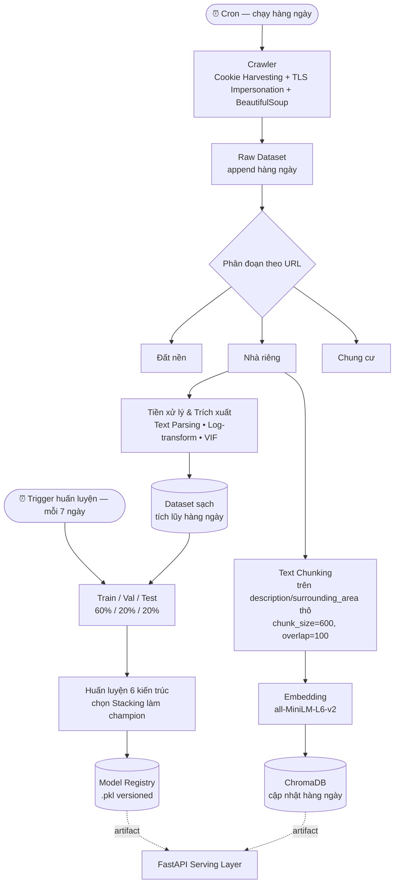
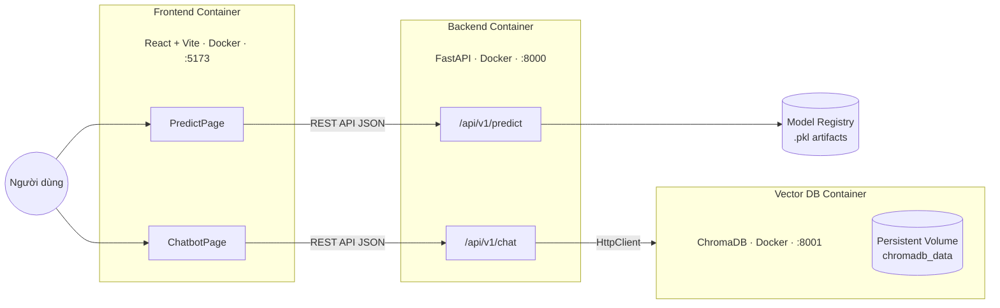

# 🏡 Aura Real Estate — Nền Tảng AI Phân Tích & Tư Vấn Bất Động Sản


---

## 📌 1. Ý Nghĩa & Bài Toán Thực Tiễn

Người mua nhà và môi giới ở TP.HCM thường gặp hai vấn đề: **không biết một tin rao có đang định giá hợp lý hay không**, và **mất nhiều thời gian lọc thủ công** giữa hàng nghìn tin đăng. Aura Real Estate giải quyết trực tiếp hai điểm nghẽn này cho phân khúc **"Nhà riêng" tại TP.HCM**, với hai tính năng:

- **🔢 Định giá nhà (Price Prediction):** nhập thông số căn nhà → trả về mức giá tham chiếu từ mô hình ML huấn luyện trên dữ liệu thị trường thật.
- **💬 Trợ lý ảo tìm kiếm (RAG Chatbot):** hội thoại tự nhiên để lọc và gợi ý bất động sản có sẵn trong kho dữ liệu.

> ⚠️ **Giới hạn phạm vi:** Chatbot **không** tư vấn pháp lý và không kết luận về tính hợp pháp/rủi ro của giao dịch. Chatbot chỉ **cung cấp thông tin mô tả căn nhà** (vị trí, diện tích, giá, tình trạng giấy tờ do người đăng cung cấp...) để hỗ trợ sàng lọc nhanh — mọi xác minh pháp lý/giao dịch vẫn cần qua kênh chính thức.

Dự án là nơi giao thoa 3 mảng năng lực AI Engineer: **Data Engineering** (crawler vượt anti-bot, tự động hóa vòng đời dữ liệu), **Applied ML** (feature engineering, kiểm soát đa cộng tuyến, ensemble learning) và **GenAI/MLOps** (RAG, prompt engineering, triển khai containerized).

---

## ⚙️ 2. Kiến Trúc Hệ Thống

Tách thành **2 sơ đồ độc lập** — luồng dữ liệu/MLOps (offline, vận hành theo lịch tự động) và luồng phục vụ (online, theo request) — mỗi sơ đồ trả lời một câu hỏi, dễ đọc hơn gộp chung.

### 2.1 Luồng Dữ Liệu & MLOps Pipeline (Offline, Tự Động Hóa Theo Lịch)
 


### 2.2 Kiến Trúc Triển Khai & Giao Tiếp API (Online / Serving)



**Ghi chú kỹ thuật:**
- 3 container (`frontend`, `backend`, `chromadb`) điều phối bằng một `docker-compose.yml`, giao tiếp qua mạng nội bộ Docker.
- **Frontend:** React + Vite + TailwindCSS, build qua **Multi-stage build** — Stage 1 dùng Node.js chạy `vite build`; Stage 2 copy bundle tĩnh sang image **Nginx** nhẹ để phục vụ routing SPA.
- **Backend:** FastAPI — nhẹ, async tốt, tự sinh Swagger. Vừa load model `.pkl` để định giá, vừa truy vấn ChromaDB cho chatbot.
- **Vector DB:** ChromaDB, port 8001, bind volume `docker_data/chromadb_data:/data` để giữ dữ liệu khi container recreate.
- Frontend **không** gọi thẳng ChromaDB — mọi truy vấn đi qua FastAPI để tách lớp và bảo mật.

---

## 🔄 3. Vòng Đời Vận Hành — Tự Động Hóa MLOps

Pipeline vận hành liên tục theo **2 chu kỳ tách biệt**, không phải chạy một lần rồi dừng:

- **Chu kỳ hàng ngày (Daily):** cron job tự động cào dữ liệu mới → tiền xử lý (parsing, lọc ngưỡng, mã hóa) → append vào dataset sạch tích lũy → đồng thời chunk + embed dữ liệu mới → cập nhật ChromaDB ngay trong ngày, đảm bảo chatbot luôn tìm thấy tin đăng mới nhất.
- **Chu kỳ 7 ngày (Weekly retrain):** sau khi tích lũy đủ 7 ngày dữ liệu mới, hệ thống mới gộp lại toàn bộ dataset sạch, chia lại Train/Val/Test và huấn luyện lại Stacking Regressor. Model mới được version hóa, ghi vào Model Registry và thay thế artifact `.pkl` đang phục vụ production.

**Lý do tách 2 chu kỳ:** RAG cần dữ liệu tươi mỗi ngày vì người dùng hỏi về tin mới đăng, nhưng retrain mô hình định giá mỗi ngày vừa lãng phí compute vừa dễ khiến mô hình dao động theo nhiễu của từng ngày lẻ. Gộp 7 ngày giúp lượng dữ liệu mới đủ lớn để việc retrain có ý nghĩa thống kê.

---

## 🕷️ 4. Thu Thập Dữ Liệu — 3 Hướng Tiếp Cận Crawler

Trang rao vặt được bảo vệ chặt bởi Cloudflare/anti-bot, dự án thử 3 hướng trước khi tìm được giải pháp ổn định để đưa vào cron job production:

| # | Hướng tiếp cận | Công cụ | Kết quả | Vấn đề |
| :-: | :--- | :--- | :---: | :--- |
| 1 | Requests + BeautifulSoup | HTTP GET thô, parse HTML tĩnh | ❌ Thất bại | Nhẹ, nhanh nhất, nhưng trang React/Vue render bằng JS chỉ trả về trang trắng; dễ dính `403 Forbidden` |
| 2 | Selenium + `undetected-chromedriver` + `selenium-stealth` | Giả lập Chrome thật | ❌ Thất bại | Vượt được JS-rendering, nhưng quá nặng RAM/CPU vì cõng cả trình duyệt thật, không khả thi ở quy mô lớn/chạy hàng ngày |
| 3 | Cookie Harvesting + TLS Impersonation + BeautifulSoup | Playwright + `curl_cffi` + BeautifulSoup | ✅ **Thành công — dùng production** | Nhanh, nhẹ, vượt anti-bot ổn định, phù hợp chạy cron hàng ngày |

Pipeline 3 bước của hướng thành công:
1. **Cookie Harvesting:** Playwright (headless Chromium) mở trình duyệt ảo thật, ghé trang chủ mục tiêu để lấy cookie "sạch" do Cloudflare cấp, rồi đóng ngay để tiết kiệm tài nguyên.
2. **TLS/JA3 Fingerprint Impersonation:** `curl_cffi` gửi request với `impersonate="chrome120"` để giả cấu trúc mã hóa TLS giống Chrome thật, kết hợp cookie ở bước 1 để qua mặt anti-bot mà vẫn giữ tốc độ HTTP thuần.
3. **HTML Parsing:** BeautifulSoup truy vấn DOM qua CSS selector (`div.js__card-listing`, `span.re__card-config-price`...) để bóc dữ liệu sạch.

Kết quả: CSV thô **18 cột**/tin đăng: `id`, `title`, `price_raw`, `area_raw`, `address_raw`, `url`, `seller_name`, `phone_number`, `bedrooms`, `bathrooms`, `floors`, `house_direction`, `legal_status`, `interior`, `ownership_type`, `price_trend`, `description`, `surrounding_area`.

---

## 📊 5. EDA & Quyết Định Xử Lý Từng Biến

18 biến thô, đánh giá theo 4 khía cạnh: **vai trò gốc → vấn đề EDA → Keep/Drop → xử lý & mã hóa**.

| Biến thô | Vai trò | Vấn đề phát hiện qua EDA | Quyết định | Xử lý & Mã hóa |
| :--- | :--- | :--- | :---: | :--- |
| `id` | Định danh | Không có giá trị dự báo | Drop (ML) | Loại ở ML; giữ làm ID chunk cho ChromaDB |
| `url` | Đường dẫn | Chứa loại hình BĐS trong path | Drop sau khi dùng | Suy ra nhãn phân khúc (0/1/2) → lọc = 1 → drop |
| `title` | Tiêu đề | Chứa từ khóa loại hình | Drop sau khi dùng | Đối chiếu chéo "Nhà riêng" → drop |
| `price_raw` | **Target** | Text hỗn loạn (`tỷ`/`triệu`/"thỏa thuận"); Skewness 7.9354, Kurtosis 87.4066; outlier hàng nghìn tỷ | **Keep (Target)** | Regex trích số, quy về Tỷ VNĐ; lọc $0 < x \le 400$ tỷ; `log1p` |
| `area_raw` | Diện tích | Lỗi định dạng (`4.335.7`); Skewness 4.4034, Kurtosis 27.7621 | **Keep (Feature #1)** | Regex trích số; lọc $10$–$600m^2$; kết hợp giá tính đơn giá/m² để loại tin ảo; `log1p` + `StandardScaler` |
| `address_raw` | Địa chỉ thô | Quá chi tiết gây nhiễu, nhưng cấp Quận quyết định giá vùng | **Keep (rút gọn)** | Regex về **23 Quận/Huyện/TP** → **Ordinal Encoding** (`DISTRICT_MAPPING`, 0–22 theo mức đắt đỏ) → `StandardScaler` |
| `bedrooms` | Phòng ngủ | Tương quan Pearson với `bathrooms` = 0.97; VIF vô cùng lớn do đa cộng tuyến với `total_rooms` | **Drop (đa cộng tuyến)** | Impute median (khóa từ train, lưu `fill_stats.json`), sau đó **drop hẳn** |
| `bathrooms` | Phòng tắm | Nhiều NaN; outlier phi thực tế (30 toilet do spam) | **Keep** | Impute median khóa lúc train; giới hạn $1$–$15$; `StandardScaler` |
| `floors` | Số tầng | Nhiều giá trị khuyết | **Keep** | Impute hằng số 1 (nhà không ghi tầng thường là cấp 4/trệt); giới hạn $1$–$15$; `StandardScaler` |
| `house_direction` | Hướng nhà | Text tự do hoặc trống (missing **80.25%**, 2,040/2,542 dòng) | **Keep (One-Hot)** | Chuẩn hóa 8 hướng chính → One-Hot 8 cột `dir_*`; bỏ "Không rõ" khỏi one-hot làm baseline (tránh Dummy Variable Trap); ép đủ 8 cột dù test thiếu hướng |
| `legal_status` | Pháp lý | Text tự do rườm rà | **Keep (quy hoạch nhãn)** | `clean_legal` gộp về 3 nhóm (`Có Sổ`/`Chưa Sổ`/`Không rõ`) → Ordinal (`LEGAL_MAPPING` 0–2) → `StandardScaler` |
| `interior` | Nội thất | Mô tả chủ quan, nhiều dòng trống | **Keep** | Phân loại 6 nhóm → Ordinal (`INTERIOR_MAPPING` 0–5) → `StandardScaler` |
| `seller_name`, `phone_number` | Liên hệ | Không có giá trị dự báo | **Drop** | Loại từ Stage 1 |
| `price_trend`, `ownership_type` | Phụ trợ | Missing cao, không đáng tin | **Drop** | Loại từ Stage 1 |
| `description`, `surrounding_area` | Mô tả dài | Văn bản quảng cáo tự do | **Drop (ML) / Keep (RAG)** | ML: loại khỏi ma trận đặc trưng. RAG: tách nhánh làm nguồn embedding cho ChromaDB |

**Kết quả sau xử lý:** 4,991 dòng thô → 4,957 dòng sau làm sạch cơ bản → **2,369 dòng sạch** (phân khúc Nhà riêng).

---

## 🔀 6. Chuẩn Hóa & Chia Tập Dữ Liệu

**Train / Val / Test = 60% / 20% / 20%** → 1,421 / 474 / 474 dòng:
- 60%: đủ lớn để học ổn định quy luật.
- 20% (Val): Grid/Randomized Search siêu tham số mà không rò rỉ thông tin từ Test.
- 20% (Test): đủ bao phủ nhiễu thị trường thực tế khi đánh giá cuối.

**Chuẩn hóa (fit trên Train, transform sang Val/Test — tránh Data Leakage):**
- `price_raw`: chỉ `log1p`, **không** `StandardScaler`.
- `area_raw`: `log1p` rồi `StandardScaler`.
- Các biến số còn lại (`bathrooms`, `floors`, các biến đã Ordinal Encoding...): `StandardScaler` fit trên Train.
- Loại biến qua **VIF** để triệt tiêu đa cộng tuyến còn sót (vd. `bedrooms`; `total_rooms` VIF=79.13 sau khi loại `bedrooms` vẫn quá cao nên tiếp tục loại).

---

## 🤖 7. Thí Nghiệm Huấn Luyện Mô Hình

### 7.1 Ba nhóm mô hình & lý do lựa chọn

| Nhóm | Mô hình | Lý do chọn |
| :--- | :--- | :--- |
| 1 | **Ridge Regression** | Baseline. Sau lọc VIF vẫn còn tương quan nhẹ (`floors`~`bathrooms`); phạt $L_2$ kiểm soát hệ số, chống overfitting |
| 2 | **Decision Tree / Random Forest** | Giá nhà không tuyến tính (diện tích lớn nhưng hẻm nhỏ vẫn rẻ). Decision Tree học luật phi tuyến; Random Forest (Bagging, 50–100 cây) giảm nhiễu từ tin ảo, giảm variance |
| 3 | **Stacking Regressor** | Kết hợp điểm mạnh cả 3 mô hình nền, dùng Meta-Learner `LinearRegression` học cách bù trừ sai số giữa các mô hình con |

### 7.2 Grid/Randomized Search trên tập Train

| Mô hình | Phương pháp | Siêu tham số | Dải khảo sát | Ý nghĩa | Tối ưu |
| :--- | :--- | :--- | :--- | :--- | :--- |
| **Ridge** | `GridSearchCV` (5-fold) | `alpha` | `[0.1, 1.0, 10.0, 100.0]` | Phạt $L_2$, co hẹp trọng số | **1.0** |
| **Decision Tree** | `GridSearchCV` (5-fold) | `max_depth` | `[5, 8, 12, 15]` | Giới hạn độ sâu | **15** |
| | | `min_samples_split` | `[5, 10, 20]` | Mẫu tối thiểu để phân nhánh | **20** |
| | | `max_features` | `['sqrt', None]` | Số đặc trưng xét mỗi lần chia | **None** |
| **Random Forest** | `RandomizedSearchCV` (5-fold, n_iter=8) | `n_estimators` | `[50, 100, 200]` | Số cây trong rừng | **50** |
| | | `max_depth` | `[10, 15, 20]` | Độ sâu mỗi cây | **20** |
| | | `min_samples_split` | `[4, 8, 12]` | Mẫu tối thiểu để phân chia | **8** |
| | | `max_features` | `['sqrt', None]` | Đặc trưng ngẫu nhiên mỗi lần chia | **None** |
| **Stacking** | — | `estimators` | Ridge + Decision Tree + Random Forest (config trên) | 3 mô hình nền | — |
| | | `final_estimator` | `LinearRegression`, `cv=5` | Meta-learner học từ dự đoán OOF | — |

### 7.3 Bảng Xếp Hạng — Các Thuật Toán Tự Cài Đặt (Scratch)

Sau khi dùng bộ siêu tham số tốt nhất từ 7.2, các mô hình được **tự viết lại từ đầu (không dùng thư viện)** để huấn luyện/đánh giá trên Train/Val:

| Hạng | Mô hình Scratch | $R^2$ | MAE | RMSE | Cách hoạt động |
| :-: | :--- | :-: | :-: | :-: | :--- |
| 🏆 1 | **Advanced Stacking (Scratch)** | **0.731082** | **0.264616** | **0.354595** | `StackingRegressorScratch` tự viết: chia fold chéo k=5 trên Train để dự báo Out-Of-Fold (OOF), dùng OOF làm meta-feature cho `LinearRegression` tự viết ở tầng cuối |
| 🥈 2 | Ensemble Voting (Scratch) | 0.701845 | 0.278364 | 0.373374 | `VotingRegressorScratch`: trung bình cộng đơn giản (`np.mean`) dự đoán của `ridge_scratch` và `tree_scratch` |
| 🥉 3 | Random Forest (Scratch) | 0.700474 | 0.278991 | 0.374231 | `RandomForestRegressorScratch` (Bagging): Bootstrap Sampling từ Train, xây song song 5 cây nông (`max_depth=6`), lấy trung bình dự đoán |
| 4 | Decision Tree (Scratch) | 0.672860 | 0.282845 | 0.391102 | `DecisionTreeRegressorScratch`: cấu trúc cây đệ quy (Node), chia nhánh theo tiêu chí Giảm Phương Sai (Variance Reduction) |
| 5 | Ridge Regression GD (Scratch) | 0.568757 | 0.337189 | 0.449039 | `RidgeRegressionScratchGD`: Gradient Descent 1,000 vòng lặp, đạo hàm cộng thêm phạt $L_2$ (`alpha * weights`) |
| 6 | Linear Regression (Scratch) | 0.568657 | 0.337219 | 0.449091 | `LinearRegressionScratchGD`: tương tự Ridge nhưng không có phạt $L_2$ |

**Mô hình chọn deploy production:** bản **thư viện** của Advanced Stacking Regressor, đạt $R^2 \approx 0.7789$ trên tập Validation — cao nhất trong toàn bộ thí nghiệm — nhờ khả năng kiểm soát phương sai vượt trội so với từng mô hình đơn lẻ. Đây cũng là model được retrain định kỳ mỗi 7 ngày theo vòng đời ở mục 3.

---

## 🧠 8. Hệ Thống RAG Chatbot — Kiến Trúc Hybrid

Chatbot dùng **Hybrid Search**: kết hợp lọc theo **metadata** (giá, diện tích, quận, hướng, pháp lý — tách riêng khỏi văn bản mô tả) với tìm kiếm **theo vector ngữ nghĩa** trên nội dung mô tả (`description`, `surrounding_area`, embedding `all-MiniLM-L6-v2`, chunk 600/overlap 100). Một truy vấn vừa lọc cứng theo metadata vừa tìm ngữ nghĩa trong cùng lệnh `collection.query()` của ChromaDB — ví dụ vừa giới hạn `price_numeric < 5.0` và `district == "Quận Bình Thạnh"`, vừa xếp hạng theo độ tương đồng ngữ nghĩa với nhu cầu người dùng.

Mỗi câu hỏi được xử lý qua 2 bước LLM (`gemini-flash-latest`):
1. **Trích xuất ý định:** một lệnh gọi riêng (temperature 0.0, ép JSON) parse câu hỏi thành tiêu chí lọc (quận, giá min/max, hướng, pháp lý, nhu cầu cốt lõi); trường không rõ luôn để `null` để tránh mô hình tự suy diễn tiêu chí không có thật.
2. **Sinh câu trả lời có kiểm soát:** kết quả truy vấn (tối đa 3 BĐS) đưa vào `system_instruction` động với các ràng buộc: chỉ tư vấn BĐS trong TP.HCM; trả lời theo kịch bản "thả mồi" — lượt đầu chỉ nêu thông tin nổi bật, chưa lộ link, chỉ bung chi tiết + link khi người dùng xác nhận ở lượt sau; chống ảo tưởng — chỉ dùng dữ liệu có sẵn, không bịa khi kho rỗng.

Hội thoại giữ trong một `chat_session` duy nhất để có trí nhớ đa lượt, cho phép chuỗi "gợi ý → xác nhận → bung chi tiết" hoạt động xuyên suốt nhiều lượt chat.

---

## 🚀 9. Tech Stack Triển Khai

| Tầng | Công nghệ | Container | Port |
| :--- | :--- | :--- | :-: |
| Frontend | React + Vite + Tailwind CSS | `frontend` | 5173 (dev) / 3000 (prod) |
| Backend | FastAPI (AsyncIO) | `backend` | 8000 |
| Vector DB | ChromaDB | `chromadb` | 8001 |

- **Backend:** `predict_service.py` tải `.pkl` model + scaler, dùng `np.expm1()` trả giá trị tiền tệ thực từ không gian log; `chatbot_service.py` điều phối ChromaDB client và Gemini API theo kiến trúc Hybrid ở mục 8.
- **Frontend:** cấu trúc feature-driven (`features/chatbot/`, `features/predict/`).

---

## 🛠️ 10. Cài Đặt & Khởi Chạy

### Kịch bản 1 — Docker Compose (khuyến nghị)

```bash
cd aura-realestate
docker-compose up --build -d
```

| Dịch vụ | URL |
| :--- | :--- |
| Frontend | http://localhost:3000 |
| Swagger UI (Backend) | http://localhost:8000/docs |
| ChromaDB | http://localhost:8001 |

### Kịch bản 2 — Chạy từng thành phần cục bộ

**Bước 1 — Pipeline ML:**
```bash
pip install -r requirements.txt
python run_pipeline.py
```

**Bước 2 — Backend API:**
```bash
cd backend
pip install -r requirements.txt
cp .env.example .env
uvicorn app.main:app --reload --port 8000
```

**Bước 3 — Frontend:**
```bash
cd ../frontend
npm install
npm run dev
```
