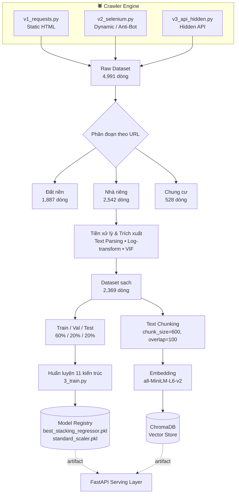
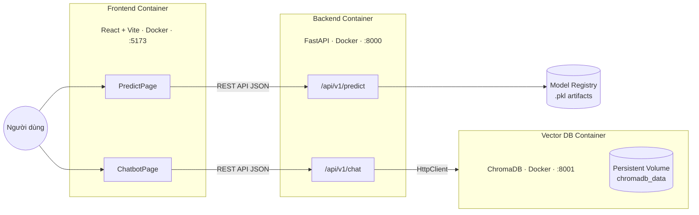

# 🏡 Aura Real Estate: Nền Tảng Phân Tích & Trợ Lý Ảo Bất Động Sản Bằng AI


---

## 📌 1. Giới Thiệu Dự Án

**Aura Real Estate** là một hệ thống AI end-to-end tích hợp Machine Learning và NLP để phân tích thị trường bất động sản, gồm hai module cốt lõi:

- **Price Analytics Engine** — dự đoán giá bất động sản bằng mô hình Ensemble (Stacking Regressor).
- **Knowledge-Base Chatbot (RAG)** — tư vấn, tra cứu thông tin dự án dựa trên Retrieval-Augmented Generation + Vector Database.

**Phạm vi:** thu thập dữ liệu đa nguồn → tiền xử lý → huấn luyện ML/RAG → đóng gói Microservices bằng Docker phục vụ frontend/backend qua REST API.

---

## ⚙️ 2. Kiến Trúc Hệ Thống

Kiến trúc được tách thành **2 sơ đồ độc lập** — một cho luồng dữ liệu/MLOps (offline, chạy theo batch), một cho luồng phục vụ thực tế (online, chạy theo request) — để mỗi sơ đồ chỉ trả lời một câu hỏi duy nhất, dễ đọc hơn nhiều so với việc gộp chung.

### 2.1 Luồng Dữ Liệu & MLOps Pipeline (Offline)



### 2.2 Kiến Trúc Triển Khai & Giao Tiếp API (Online / Serving)



**Ghi chú kỹ thuật:**
- 3 container (`frontend`, `backend`, `chromadb`) được điều phối bằng một `docker-compose.yml` duy nhất, giao tiếp qua mạng nội bộ Docker.
- Frontend **không** gọi thẳng ChromaDB — mọi truy vấn đều đi qua FastAPI để đảm bảo tách lớp (separation of concerns) và bảo mật.
- Volume `docker_data/chromadb_data:/data` đảm bảo dữ liệu vector không mất khi container bị recreate.

---

## 🕷️ 3. Thu Thập Dữ Liệu Đa Nguồn

| Thành phần | Kỹ thuật | Mục đích |
| :--- | :--- | :--- |
| `v1_requests.py` | `requests` + `BeautifulSoup4`, fake User-Agent luân phiên | Trang HTML tĩnh, ưu tiên tốc độ |
| `v2_selenium.py` | `undetected-chromedriver` + `selenium-stealth` | Trang SPA/JS nặng, vượt Anti-Bot (Cloudflare, PerimeterX) |
| `v3_api_hidden.py` | Reverse engineering Network Traffic | Khai thác API ẩn, trả JSON sạch, băng thông thấp |

---

## 📊 4. Bảng Tổng Hợp EDA & Quyết Định Xử Lý Biến

Thay vì trình bày EDA theo trình tự notebook, toàn bộ kết luận được gộp vào **một bảng tra cứu duy nhất**: mỗi hàng là một biến thô thu thập được từ crawler, mỗi cột là một khía cạnh quyết định.

> ⚠️ **Lưu ý:** Dataset thô có **18 trường** (fields) được crawl về. Dưới đây là các trường đã có kết luận EDA xác thực từ notebook gốc. Các trường còn lại được để dạng placeholder — vui lòng điền số liệu thật từ `notebook 03` trước khi publish, để tránh đưa số liệu suy diễn vào tài liệu kỹ thuật.

| # | Tên Biến Thô | Kiểu Dữ Liệu | Đặc Tính / Kết Luận Từ EDA | Quyết Định Xử Lý |
| :-: | :--- | :--- | :--- | :--- |
| 1 | `price_raw` | Liên tục (Target) | Skewness = **7.93**; chứa giá trị ≈0 do lỗi nhập liệu và outlier cực đoan (biệt thự trăm tỷ) | Lọc ngưỡng vật lý $0 < x \le 400$ Tỷ VNĐ → `np.log1p()` |
| 2 | `area_raw` | Liên tục | Skewness = **4.40**; lỗi định dạng số thập phân | Lọc ngưỡng $10m^2 \le x \le 600m^2$ → `np.log1p()` |
| 3 | `bedrooms` | Rời rạc | Tương quan Pearson với `bathrooms` = **0.97** (Spearman 0.86) → đa cộng tuyến nghiêm trọng | Giữ lại, xử lý đa cộng tuyến qua VIF ở bước sau |
| 4 | `bathrooms` | Rời rạc | Tương quan Pearson với `bedrooms` = **0.97** | Xét loại bỏ / gộp biến qua chỉ số VIF (Notebook 05) |
| 5 | `house_direction` | Phân loại | Missing **80.25%** (2,040/2,542 dòng NaN) | **Không impute bằng Mode** (gây lệch phân phối) → gán nhãn `"Unknown"` |
| 6 | `legal_status` | Phân loại | Nhiễu văn bản cao (`Sổ đỏ`, `SHCC`, `HĐMB`, `Giấy tờ tay`...) | Dictionary Mapping → chuẩn hóa còn 3 nhãn: `Sổ đỏ/Sổ hồng`, `Hợp đồng mua bán`, `Không rõ` |
| 7 | `interior` | Phân loại | Mô tả chủ quan, nhiều dòng trống | Ánh xạ chuẩn hóa → 4 cấp: `Cao cấp`, `Đầy đủ`, `Cơ bản`, `Thô/Không rõ` |
| 8 | `floors` | Rời rạc | *[Cần bổ sung số liệu EDA — vd. % missing, phân phối]* | *[Cần bổ sung quyết định xử lý]* |
| 9 | `title` | Văn bản thô | *[Cần bổ sung]* — nguồn trích xuất `area_raw`, `price_raw` qua text parsing | Giữ lại, dùng làm nguồn trích xuất đặc trưng |
| 10 | `url` | Định danh | *[Cần bổ sung]* | Dùng để phân đoạn dữ liệu (Đất nền / Nhà riêng / Chung cư) qua cấu trúc URL |
| 11 | `description` | Văn bản thô | *[Cần bổ sung]* | Đầu vào cho pipeline RAG (`pure_doc_text`) |
| 12 | `address` | Phân loại/Văn bản | *[Cần bổ sung — % missing, số lượng khu vực]* | *[Cần bổ sung]* |
| 13 | `post_date` | Ngày/giờ | *[Cần bổ sung]* | *[Cần bổ sung]* |
| 14 | `project_name` | Phân loại | *[Cần bổ sung]* | *[Cần bổ sung]* |
| 15 | `contact_phone` | Định danh | *[Cần bổ sung]* | *[Cần bổ sung — có thể loại bỏ vì không có giá trị dự đoán]* |
| 16 | `image_urls` | Danh sách URL | *[Cần bổ sung]* | *[Không dùng cho mô hình bảng số hiện tại]* |
| 17 | `property_type` | Phân loại | *[Cần bổ sung]* | Dùng làm nhãn phân đoạn 3 tập con |
| 18 | `seller_type` (cá nhân/môi giới) | Phân loại | *[Cần bổ sung]* | *[Cần bổ sung]* |

**Kết quả sau xử lý:** 4,991 dòng thô → 4,957 dòng sau làm sạch cơ bản → **2,369 dòng sạch** sau toàn bộ pipeline (chỉ tính phân khúc Nhà riêng), chia Train 1,421 / Val 474 / Test 474.

**Biến đổi áp dụng cho toàn bộ ma trận:** `One-Hot Encoding` cho biến phân loại bậc thấp; `StandardScaler` cho biến số; loại bỏ biến qua chỉ số **VIF** để triệt tiêu đa cộng tuyến còn sót.

---

## 🤖 5. Thí Nghiệm Huấn Luyện Mô Hình

### 5.1 Bảng Tinh Chỉnh Siêu Tham Số Theo Từng Mô Hình

Cấu hình siêu tham số **cuối cùng** được chọn cho mỗi kiến trúc (trích từ `pipelines/3_train.py`). Nếu quá trình tìm kiếm có dùng Grid/Random Search với dải giá trị cụ thể, nên bổ sung cột "Dải tìm kiếm" — hiện README gốc chỉ có giá trị cuối nên bảng dưới phản ánh đúng phạm vi đó.

| Mô Hình | Siêu Tham Số | Giá Trị Đã Chọn |
| :--- | :--- | :--- |
| **Ridge Regression** | `alpha` | 1.0 |
| | `random_state` | 42 |
| **Decision Tree Regressor** | `max_depth` | 15 |
| | `min_samples_split` | 20 |
| | `max_features` | None |
| | `random_state` | 42 |
| **Random Forest Regressor** | `n_estimators` | 50 |
| | `max_depth` | 20 |
| | `min_samples_split` | 8 |
| | `max_features` | None |
| | `n_jobs` | -1 |
| | `random_state` | 42 |
| **Advanced Stacking Regressor** | `estimators` (base) | Ridge, Decision Tree, Random Forest (cấu hình như trên) |
| | `final_estimator` | LinearRegression |
| | `cv` | 5 |
| | `n_jobs` | -1 |

### 5.2 Bảng Xếp Hạng Mô Hình (Tập Validation)

Sắp xếp theo $R^2$ Score giảm dần. Cột "Siêu tham số tốt nhất" tham chiếu trực tiếp đến bảng 5.1.

| Hạng | Mô Hình | $R^2$ | MAE | RMSE | Siêu Tham Số Tốt Nhất | Ghi Chú |
| :-: | :--- | :-: | :-: | :-: | :--- | :--- |
| 🏆 1 | **Advanced Stacking Regressor** | **0.7789** | **0.2305** | **0.3215** | Xem 5.1 – Stacking | **Champion — Deploy Production** |
| 🥈 2 | Random Forest (Tuned Lib) | 0.7788 | 0.2288 | 0.3216 | `n_estimators=50, max_depth=20, min_samples_split=8` | Challenger trực tiếp |
| 🥉 3 | Advanced Stacking (Scratch) | 0.7311 | 0.2646 | 0.3546 | Tự cài đặt tầng Ensemble | Đối chiếu triển khai thủ công |
| 4 | Ensemble Voting (Ridge + RF) | 0.7301 | 0.2611 | 0.3553 | Bình quân trọng số hiệu năng | - |
| 5 | Ensemble Voting (Scratch) | 0.7018 | 0.2784 | 0.3734 | - | - |
| 6 | Random Forest (Scratch) | 0.7005 | 0.2790 | 0.3742 | - | - |
| 7 | Decision Tree (Tuned Lib) | 0.6733 | 0.2814 | 0.3909 | `max_depth=15, min_samples_split=20` | - |
| 8 | Decision Tree (Scratch) | 0.6729 | 0.2828 | 0.3911 | - | - |
| 9 | Ridge Regression GD (Scratch) | 0.5688 | 0.3372 | 0.4490 | `alpha=1.0` | Gradient Descent thủ công |
| 10 | Ridge Regression (Tuned Lib) | 0.5688 | 0.3372 | 0.4490 | `alpha=1.0` | Trùng khớp bản Scratch |
| 11 | Linear Regression (Scratch) | 0.5687 | 0.3372 | 0.4491 | - | Baseline |

**Kết luận:** `Advanced Stacking Regressor` được deploy production nhờ $R^2 \approx 0.779$ tốt nhất và khả năng kiểm soát phương sai vượt trội so với các mô hình đơn lẻ.

---

## 🧠 6. Hệ Thống RAG & Prompt Engineering

- **Chunking:** `chunk_size=600`, `overlap=100` ký tự trên chuỗi `pure_doc_text`.
- **Embedding:** `all-MiniLM-L6-v2` → lưu vào **ChromaDB** (metadata: ID, giá, khu vực).
- **System Prompt** kiểm soát hallucination:

```text
Bạn là một chuyên gia tư vấn bất động sản cấp cao thuộc hệ thống Aura Real Estate.
Hãy phân tích các thông số thị trường và tài liệu ngữ cảnh được cung cấp dưới đây
để phản hồi câu hỏi của người dùng một cách tường minh nhất.

[CONTEXTUAL RAW DATA INJECTED HERE]

RÀNG BUỘC CỐT LÕI: Nếu thông tin cần tìm không xuất hiện trong ngữ cảnh được cung cấp,
bạn phải trả lời "Hệ thống hiện chưa có dữ liệu chính xác về trường hợp này".
Tuyệt đối không tự biên soạn hoặc giả lập số liệu.
```

---

## 🚀 7. Tech Stack Triển Khai

| Tầng | Công nghệ | Container | Port |
| :--- | :--- | :--- | :-: |
| Frontend | React + Vite + Tailwind CSS | `frontend` | 5173 (dev) / 3000 (prod) |
| Backend | FastAPI (AsyncIO) | `backend` | 8000 |
| Vector DB | ChromaDB | `chromadb` | 8001 |

- **Backend:** `predict_service.py` tải `.pkl` model + scaler, thực hiện `np.expm1()` để trả giá trị tiền tệ thực; `chatbot_service.py` điều phối giữa ChromaDB client và LLM API.
- **Frontend:** Feature-driven structure (`features/chatbot/`, `features/predict/`).

---

## 🛠️ 8. Cài Đặt & Khởi Chạy

### Kịch bản 1 — Docker Compose (khuyến nghị)

```bash
cd aura-realestate
docker-compose up --build -d
```

| Dịch vụ | URL |
| :--- | :--- |
| Frontend | http://localhost:3000 |
| Swagger UI (Backend) | http://localhost:8000/docs |
| ChromaDB | http://localhost:8001 |

### Kịch bản 2 — Chạy từng thành phần cục bộ

**Bước 1 — Pipeline ML:**
```bash
pip install -r requirements.txt
python run_pipeline.py
```

**Bước 2 — Backend API:**
```bash
cd backend
pip install -r requirements.txt
cp .env.example .env
uvicorn app.main:app --reload --port 8000
```

**Bước 3 — Frontend:**
```bash
cd ../frontend
npm install
npm run dev
```
